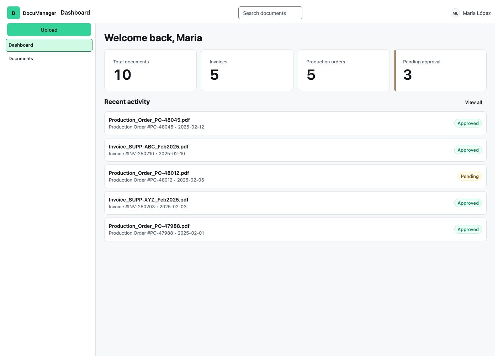
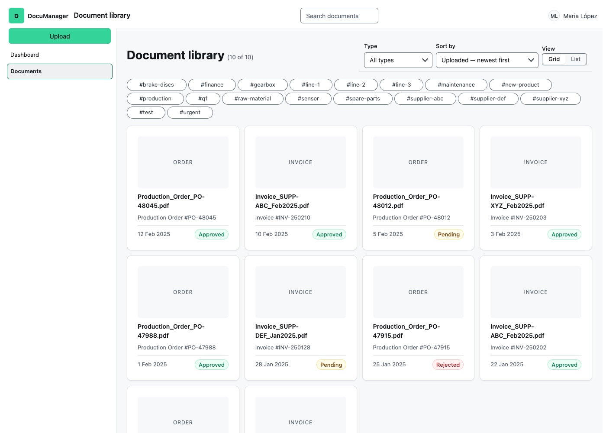
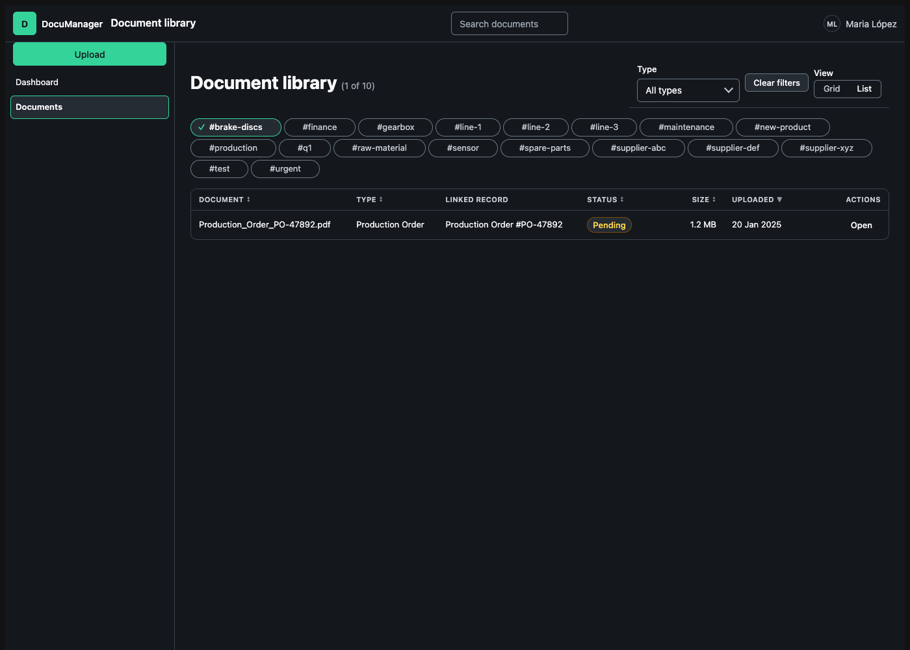
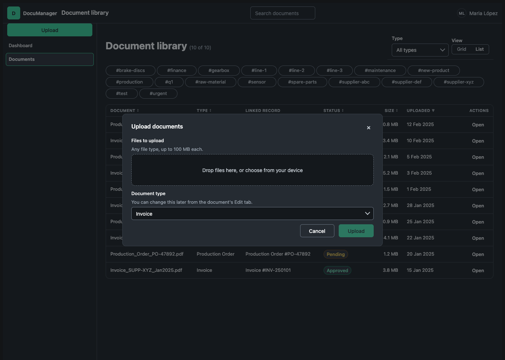
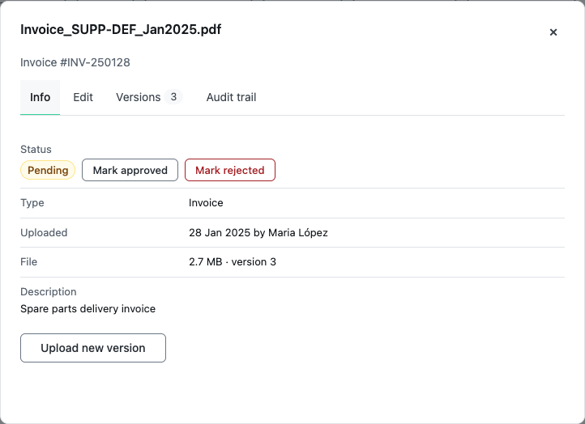
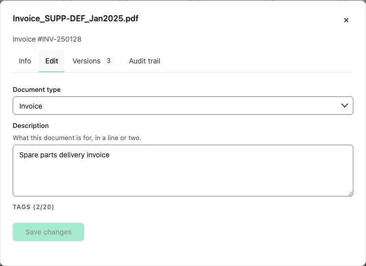
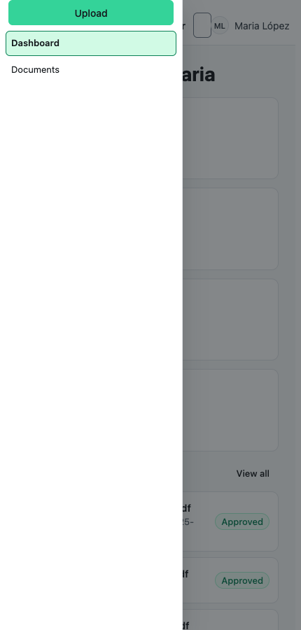
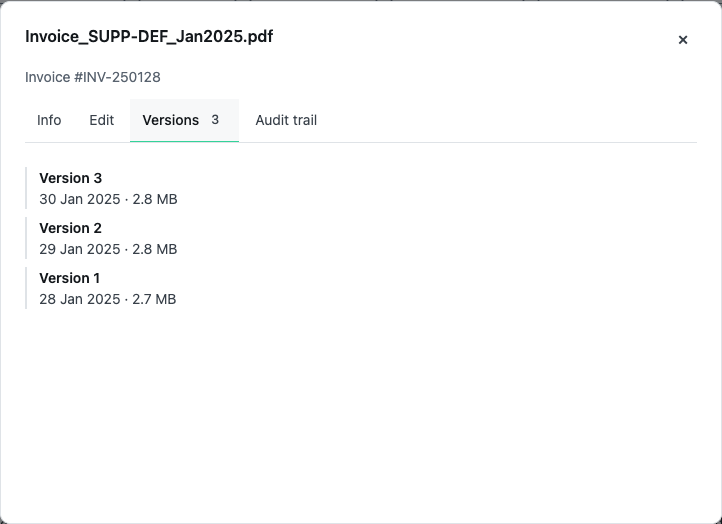

# How DocuManager was designed

A walkthrough for someone who has just landed in this repository and wants to
see the process rather than the result: what was researched, what that research
changed, what got drawn before it got built, and where the drawing turned out to
be wrong.

Read in this order. Every claim links to the artefact it came from, and the
artefacts are in this repository — not in a chat log.

Two companion documents sit beside this one:
**[use-case.md](use-case.md)** is the chapter map — the same project as thirteen
numbered chapters, each with a status, so you can see what exists and what does
not. **[user-journey.md](user-journey.md)** is the journey and service
blueprint: six phases, the line of interaction, the line of visibility, and each
risk paired with the decision that answers it.

---

## 1 · Research — what four established systems actually do

**[Competition audit →](../Competition%20audit/)** ·
**[Design canvas: `design/competition-audit.canvas.html`](design/competition-audit.canvas.html)**

Four document management systems, read from **administrator documentation and
published service limits** rather than marketing pages. Vendor marketing
produced nothing checkable and was not used. The systems are described by
category on the canvas; the repository document names them and links every
source.

**What it changed: the requirement set went from 106 to 168.** Not all of that
growth is market-traceable, and the audit is careful about which is which. It
sorts its findings into three kinds — what the market *confirmed* (it already
works the way we wrote it), the three *gaps* it found in at least two systems
each, and where we are deliberately *stricter* than the market. Each finding
links the documented statement behind it and the requirement ids it touches.

The rest of the growth came from three whole new areas added in the same pass —
permissions, retention, bulk operations — which the audit motivated but did not
dictate. Those are our decisions, not the market's, and the audit's "stricter
than the market" section says so.

The canvas carries five boards:

| Board | What it settles |
| ----- | --------------- |
| Audit result | The 106 → 168 move, and which category each change fell into |
| Capability comparison | Where each system stands, capability by capability, with requirement ids |
| Permission rules | Access decided by **what a document is**, not where it sits (`PRM-9`, `PRM-10`) |
| Retention | A policy as an object with a lifecycle — draft, active, retired (`RET-5`, `RET-7`) |
| Bulk operations | The selection model, specified once (`BLK-1`) |

**No competitor interface is reproduced anywhere in this repository**, and the
audit says so in its own method section: vendor screens are third-party
material, so the audit was read from documentation instead. The three images in
[`design/competition-audit-artboards/`](design/competition-audit-artboards/)
(`rules.jpg`, `retention.jpg`, `bulk.jpg`) are **our own designs**, one per
finding, each annotated with numbered callouts — the same three screens as
[`Competition audit/screens/`](../Competition%20audit/screens/).

---

## 2 · Requirements — 168 of them, each checkable

**[requirements/ →](../requirements/)**

The audit's output is a requirement set written to be read by someone
specifying the system, not by someone admiring the prototype: a stable id, one
statement of intent, and acceptance criteria that can be checked. Ten areas,
from dossier management to sort.

The honest part is
**[the status table](../requirements/README.md#status-in-this-prototype)**: of
168 requirements the prototype meets 26, partially meets 7, and does not
implement 135. It also separates *not built yet* from *built wrong*, which is
the distinction an area-level summary hides.

---

## 3 · Concept — drawing the upload flow before building it

**[Design canvas: `design/upload-flow.canvas.html`](design/upload-flow.canvas.html)** ·
sources in [`design/upload-flow-artboards/`](design/upload-flow-artboards/)

Four boards, in the order the flow happens:

| Board | The decision in it |
| ----- | ------------------ |
| **1 · Getting files in** | Limits are visible before anyone hits them; a rejected file names itself and its reason; a bad file in a batch never costs you the good ones (`UPL-1`, `UPL-2`) |
| **2 · The choice** | A checksum match is not a duplicate to be resolved silently. Say what it matched, offer the two real options with their consequences, and **preselect neither** (`UPL-8`, `UPL-11`, `UPL-12`) |
| **3 · Three cases** | See below — this is the one that changed a requirement |
| **4 · Metadata** | Proposed, never demanded. The file already knows most of it, so the person corrects rather than transcribes (`UPL-19`, `UPL-21`) |

### The finding worth the whole exercise

`UPL-8` was written as one case: an upload whose checksum matches an existing
document offers to version it.

**Drawing it turned up three cases, and two of them change what the dialog is
allowed to say:**

1. The upload matches the **current** version — versioning must be *refused*,
   not offered. A new version would differ from the current one in nothing but
   its number (`UPL-18`).
2. The upload matches an **earlier** version — this is a restore, not a
   duplicate.
3. The upload matches **another document** — versioning is meaningless; this is
   a filing decision.

A requirement that reads as complete prose can still describe one third of its
own problem. That is the argument for drawing a flow before implementing it, and
it is why this canvas is in the repository rather than in someone's notes.

### And what the drawing got wrong

The `4 · Metadata` board proposes reading title, type and dates out of the file
itself. **The prototype does none of that** — there is no server to extract text
with, so `UPL-21` (extraction and OCR) is unimplemented and the board is a
design for a system that does not exist yet. It is kept as drawn rather than
quietly redrawn to match what shipped.

---

## 4 · Build — every control from a design system

**[Big Hat design system →](https://github.com/Konstancja-Tanjga/bighat-design-system)** ·
[Storybook](https://konstancja-tanjga.github.io/bighat-design-system/)

The prototype's rule is that every interactive control comes from
`@bighat/ui` — nothing restyled, wrapped or forked. The point was not the
document management; it was **what a real screen looks like when the design
system is a hard constraint, and what happens where the system runs out.**

Six controls had to be hand-rolled because the system had no answer. All six are
now *in* the system, and three of them were built there **because of this
project** — `Textarea`, `FilterChip` + `RemovableChip`, and `FileDropzone`.

Those three ship in the design system's 4.2.0, which is **not on its `main`
branch yet**: it is on `chip-textarea-filedropzone`, which is exactly what this
prototype's `package.json` pins. So the evidence for each — including what the
hand-rolled version did worse — is on that branch:
[`DS-GAPS.md`](https://github.com/Konstancja-Tanjga/bighat-design-system/blob/chip-textarea-filedropzone/DS-GAPS.md).
When it merges, both this link and the pin move to `main`.

That round trip — build a product against a system, find the holes, close them
upstream — is the part of the process this repository exists to show.

---

## 5 · The result

[`screens/`](screens/) — captured from the running prototype, both themes.

| | |
| --- | --- |
|  |  |
| Dashboard | Document library, grid view |
|  |  |
| A tag filter applied, dark theme | Upload, with the system's `FileDropzone` |
|  |  |
| Document detail, `Tabs` + `DescriptionList` | Editing, `Textarea` + `RemovableChip` |
|  |  |
| Below 900px, navigation as an overlay | Version history |

---

## Reading the canvases

`design/*.canvas.html` are Claude Design canvases. **Open them in a browser** —
each is a self-contained page with its own editor, and the artboards render
there. They do not render from a plain `file://` preview or a static
screenshotter, which is why there are no PNG stand-ins for them: a
half-loaded canvas image would misrepresent the work.

`design/*-artboards/` holds each artboard's own source, extracted from the
canvas, so the content is greppable and reviewable in a diff. Those files
reference the canvas runtime and are not meant to be opened directly.
